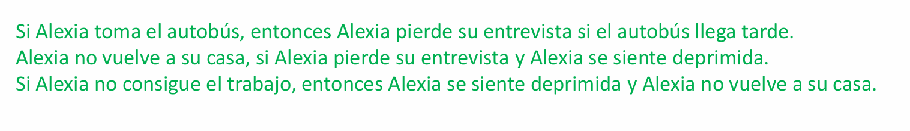

A: alexia toma el autobus  
B: Alexia pierde su entrevista  
C: Autobus Llega tarde  
D: Alexia vuelve a su casa  
E: Alexia deprimida  
F: alexia trabajo

1: A -> (B ->C)
2: (B y E) -> -D
3: -F ->(e y (-D)) 