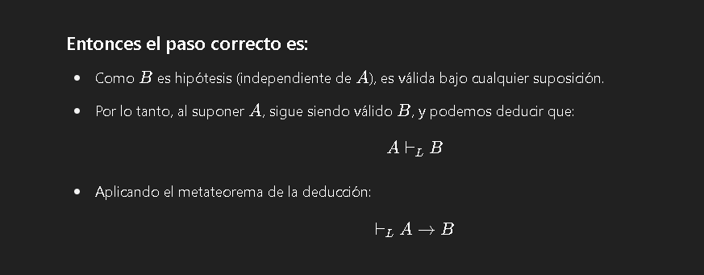

### TP9 FTC
### Sistema formal L: axiomas y reglas de inferencia

Ejercicio 1. Dada la siguiente demostración sintáctica válida en  : 𝐿
 
1.   (((¬𝑝)→(¬(𝑞→𝑟)))→((𝑞→𝑟)→𝑝))
2.    ((-p)->(-(q->r))
3.  ((q->r)->p)
 
a)  Identificar  el  conjunto  R  con  menor  cantidad  de  fórmulas  bien  formadas  (fbfs) y la 
fórmula  A  tal  que Γ├L 𝐴 .  Indicar,  si  es  posible,  que  axioma,  hipótesis  o  regla  de 
inferencia fue aplicado en cada paso de la demostración. 
1. Axioma L3
2. Hipotesis
3. MP de 1 y 2
R={((-p)->(-(q->r))}
A = ((q->r)->p)
b)  ¿Es A  un teorema de  L? Justificar.
para comprobar si A es un teroma de L hay que ver si se cumple
() ├𝐿 𝐴, es decir si con un conjunto vacio se deduce con L A.
() |-L ((q->r)->p)
por metateorema de la deduccion podemos decir que si probamos esto eso se cumple.
(,(q->r)) |-L p

c)  ¿Es A  tautología? Justificar.
A no es una tautologia.
si q = V, r = V, p = f, el valor el falso de A

Chat GPT confirma ajdsja

Ejercicio  2. Sean  A,  B y C  tres fórmulas bien formadas (fbfs) del sistema formal  . Dar una 
demostración  sintáctica  en  L  de  las  siguientes  deducciones.  Justificar  cada  paso  en  la 𝐿
derivación, indicando cuales son los axiomas instanciados y las reglas de inferencia utilizadas.  
 
Ayuda: es posible utilizar, si es necesario, propiedades ya demostradas en el libro de Hamilton, 
como  por  ejemplo,  metateorema  de la Deducción, silogismo hipotético (SH), y otros teoremas 
ya demostrados en el libro (ver prop 2.11a y prop 2.11b).

Segun F
I. |-L (((-A)->A)->A)
Por Metateorema de deduccion podemos saber que 
|-L (((-A)->A)->A) =

 ((-A)->A) |-L A

1) ((-A)->A) hipotesis
2) (-A->((-A->A)->-A)) axioma L1
3) ((-A->A)->-A)->(A ->-(-A->A)) axioma L3
4) (-A -> (A -> -(-A -> A))) 2 y 3 por SH
5) Mas en el libro pagina 46

Segun hamilton:
II. |-L (((-B)->(-A))->(((-B)->A)->B))
por meta teorema de deduccion:
(((-B)->(-A))|-L(((-B)->A)->B))
1.(-B) -> (-A -> -B) axioma L1
2. (-a -> -b) -> (b -> a) axioma L3
3. (-B) -> (b->a) 1 y 2 por SH

Segun chat
III. {((A -> B)->C),B} |-L(A->C)
Por metateorema dededuccion:
{((A -> B)->C),B,A} |-L C
1) ((A -> B)->C) hipotesis
2)  B hipotesis
3)  A hipotesis
4)  A -> B ???????
    1)  ?????
5) C MP de 1 y 4
lISTO

3) Sea R un conjunto de fbfs del sistema formal L. Se sabe que R|-L A ¿Es cierto que para todo Ri tal que Ri C R;Ri |-L A ? Fudar.
   No ya que puede pasar que Ri no sea suficiente par a|-L A
   Poer ejemplo en el III del anterior punto 
   Ri = {B}.
   Pero B |-L (A-C) no se cumple

4) Sea A una fbf y R un conjunto de fbfs Si se cumple R |-L A ¿Es cierto que vale |-A para todo A y para  todo R? Justificar.
   NO en el ejemplo de arriba.
   R ={((A -> B)->C),B}
   R |-L (A->C) verdadero
|-L (A->C) Falso

Ejercicio 5. Determinar si las siguientes afirmaciones son válidas o no en el sistema formal  . 𝐿
Justificar en cada caso. 

I . q |-L (p -> q)
Aplicando metateorema de deduccion:
q,p |-L q
1) q hipotesis
   Listo
II. (p -> q) |-L (q)

Podria decir:
|-L (p -> q) -> q

 
 No veo Solucion ????

 6. Sean A, B y C fbfs del C. de Enunciados. Sea R un conjunto de fbfs del C. de Enunciados. Se sabe que R U {A,B} |-L C y tambien se sabe que R |-L A.
    1. Es cierto que R |-(C -> B)? Justificar
       1. Podemos decir por metateorema de deducciones
            R U {C} ||-L B
    2. Es cierto que |-L A? Justificar 
   A simple vista no no es cierto

Ejercicio 7. ¿Es el sistema formal L  decidible? Justificar.
Ayuda: si es decidible, debería ser posible determinar (decidir) para cada fbf, si es o no teorema 
de  L. 
   Si si es decidible ya que se puede hacer la tabla de verdad y aunque tarde mucho siempre va a terminar